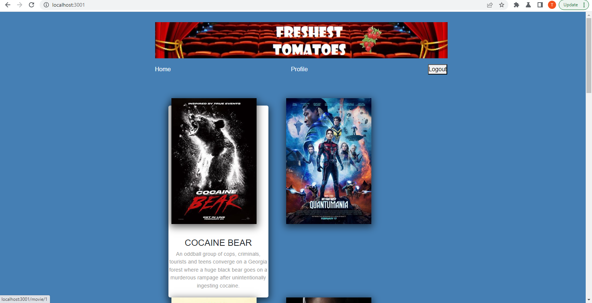
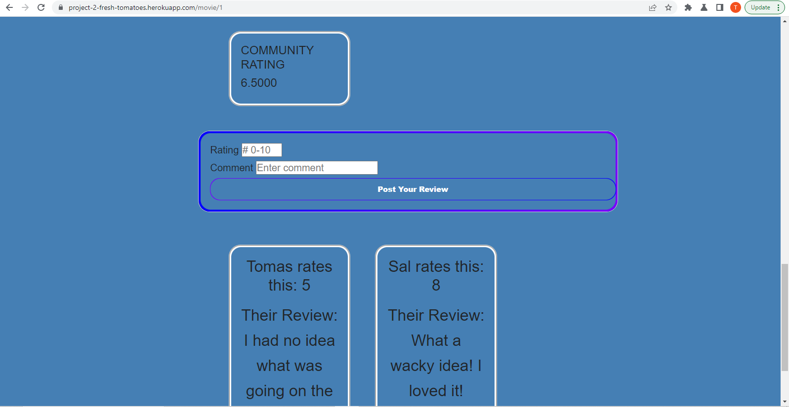
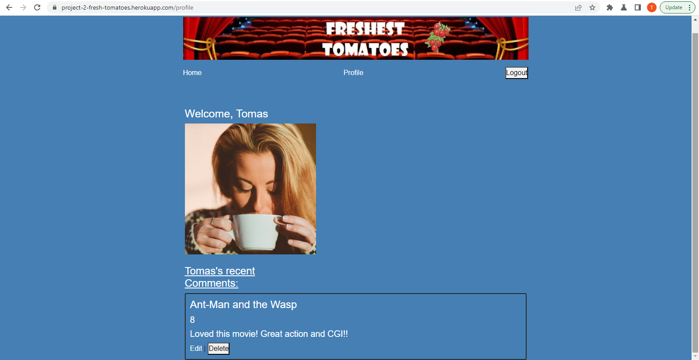
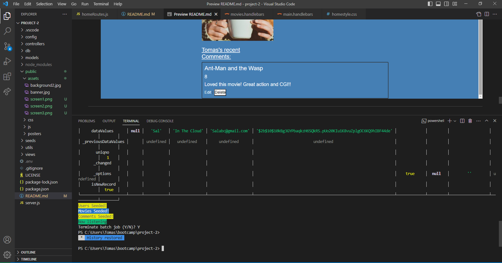

# Freshest Tomatoes

## Description
This application allows users to view the top 10 new movies, where they are able to create an account giving them access to leave ratings and reviews. 
#
## Table of Contents
* [User Story](#user-story)
* [Acceptance Criteria](#acceptance-criteria)
* [Goal](#goal)
* [Deployed Link](#deployed-link)
* [Installation](#installation)
* [Usage](#usage)
* [License](#license)
* [Collaborators](#collaborators)
#

## User Story
```mb
AS A regular cinema goer and critic,
I WANT to see a list of the top new movies, and create an account where I can rate and review them
SO THAT others can see how I felt about a certain movie.
```
## Acceptance Criteria
```mb
GIVEN a CMS-style application
WHEN I visit the site for the first time
THEN I am presented with the homepage, which includes a list of the top 10 new movies with a description of the movie when i hover over it, and a login button at the top
WHEN I click the login button
THEN I am prompted to either sign up or log in
WHEN I choose to sign up
THEN I am prompted to enter a name, email, and password
WHEN I click on the sign-up button
THEN my user credentials are saved and I am logged into the site
WHEN I revisit the site at a later time and choose to sign in
THEN I am prompted to enter my email and password
WHEN I am signed in to the site
THEN I see a profile button on the homepage and an option to log out
WHEN I click on a movie now
THEN I am taken to a page for the movie and presented with existing ratings and reviews posted by others, along with an input form
WHEN I enter a rating and a review in the speicic box and click on the post button while signed in
THEN the comment is saved and the review is posted on the page with the other reviews with my name, email, rating, and review. I am then redirected to the profile page
WHEN I am on the profile page
THEN I can see my username, my location, my current #1 movie based on rating, current favourite movie, and my reviews.
WHEN I click on one of my existing posts on the page
THEN I am able to delete or update my post and taken back to an updated dashboard
WHEN I click on the logout option in the navigation
THEN I am signed out of the site


```
#
## Goal
- Must use Node.js and Express.js to create a RESTful API
- Must use Handlebars.js as the template engine
- Must use MySQL and the Sequalize ORM for the database
- Must have both GET and POST routes for retrieving and adding new data
- Must use at least one new library, package, or technology that were not discussed
- Must have a folder structure that meets the MVC paradigm
- Must include authentication (express-session and cookies)
- Must protect API keys and sensitive information with environment variables
#
## Deployed link 
Click [here](https://project-2-fresh-tomatoes.herokuapp.com/) for the deployed link through Heroku.
#
## Presentation
click [here](https://docs.google.com/presentation/d/1KA0yLQmZFV984IVncTodaIq3ErpneIYB6p7PQzqNyWU/edit?usp=sharing) for our Presentation.
#
## Installation
- Clone or Dowload as a zip file via Github
- In the command line, enter "npm install inquirer" and "npm install mysql" if not done already.
#
## Usage
- In the command line enter "mysql -uroot -p" and put in the password.
- Next, enter "source ./db/schema.sql;" and then "quit".
- Lastly, put in "node seeds" to seed the data.
- Simply enter "npm start" to execute file.
- Go to your browser and type in 'localhost:3001'.





The last screen shows Chalk being used in development.

#
## License 
 
#

## Collaborators
Alister Porteous Email: alisterporteous@hotmail.com
Github: https://github.com/porteous89

Nav Aulakh Email: navdeep_aulakh24@hotmail.com
Github: https://github.com/navaulakh24

Tamas Pinter Email: brolli_673@hotmail.com
Github: https://github.com/TamasPinter
